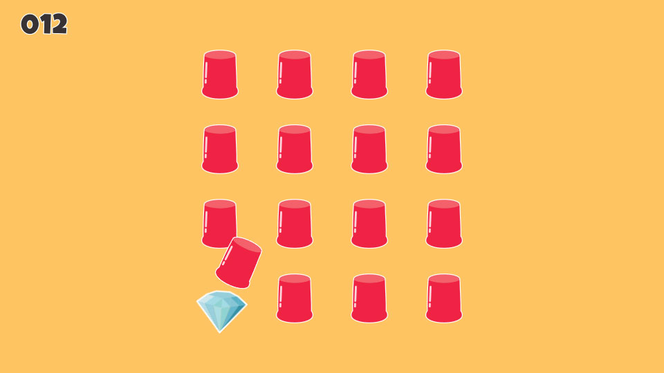

## Instrukcja do warsztatu

1. Utworzenie `prefab`-a o nazwie `Mug` reprezentującego kubek, tzn. zawierającego grafiki kubka i diamentu.
2. Utworzenie pierwszej animacji podskoku kubka o nazwie `MugJumpAnimation` w katalogu `Animations`.
3. Dodanie `trigger`-a o nazwie `Jump` w panelu `Animator` i ustawienie maszyny stanów przez dodanie pustego stanu `Idle` oraz dodanie tranzycji do stanu `MugJump` (zmiana nazwy z `MugJumpAnimation`).
4. Dodanie skryptu `MugScript` i utworzenie `coroutine`-y (współprogram):
```cs
	Animator animator;
	private void Start()
	{
	    animator = GetComponent<Animator>();
	    StartCoroutine("JumpRandomly");
	}
	IEnumerator JumpRandomly()
	{
	    for (; ; )
	    {
	        yield return new WaitForSeconds(Random.Range(2.0f, 10.0f));
	        AnimatorStateInfo animatorStateInfo = animator.GetCurrentAnimatorStateInfo(0);
	        if (animatorStateInfo.IsName("Idle"))
	        {
	            animator.SetTrigger("Jump");
	        }
	    }
	}
```
5. Dodanie skryptu `GameScript` do obiektu `Game` zawierającego logikę gry.
```cs
public class GameScript : MonoBehaviour
{
    public GameObject mugPrefab;
    [System.NonSerialized]
    public int nofLiftedMugs = 0;
    [System.NonSerialized]
    public int nofClicks = 0;
    public int currentLevel = 1;
    private List<GameObject> mugs = new List<GameObject>();

    void Start()
    {
        Init();
    }

    public void Init()
    {
        // clears all mugs before level restarting
        foreach (GameObject mug in mugs)
        {
            Destroy(mug);
        }
        mugs.Clear();

        // generates mugs for the current level
        int nofMugs = currentLevel * 4;
        int indexOfMugWithDiamond = Random.Range(0, nofMugs);
        int indexOfMug = 0;
        for (int row = currentLevel - 1; row > -currentLevel; row -= 2)
        {
            for (int column = -3; column <= 3; column += 2)
            {
                Vector3 position = new Vector3(column, row, 0);
                GameObject mug = Instantiate(mugPrefab, position, Quaternion.identity);
                mugs.Add(mug);
                indexOfMug++;
            }
        }

        // resets some properties
        nofLiftedMugs = 0;
    }
}
```
6. Przypisanie `prefab`-a `Mug` do pola `mugPrefab` (w edytorze widoczny jako `Mug Prefab`).
7. Stworzenie w zakładce `Game` nowego widoku o nazwie `Half of FullHD` o rozmiarach 960 x 540.
8. Uruchomienie gry.
9. Ukrycie diamentu oraz ustalenie kolejności wyświetlania poprzez dodanie kodu w metodzie `Init()`.
```cs
...
GameObject mug = Instantiate(mugPrefab, position, Quaternion.identity);
mug.transform.GetChild(0).gameObject.GetComponent<SpriteRenderer>().sortingOrder = indexOfMug + 1;
mug.transform.GetChild(1).gameObject.GetComponent<SpriteRenderer>().enabled = indexOfMug == indexOfMugWithDiamond;
mugs.Add(mug);
...
```
11. Nadanie właściwej kolejności grafikom w `prefab`-ie `Mug`.
12. Dodanie animacji `MugLiftAnimation`, `MugLayDownAnimation` oraz `DiamondZoomInAnimation` (pamiętać o kopiowaniu wartości komponentów).
13. Dodanie w panelu animator wyzwalaczy, stanów oraz tranzycji.
14. Uzupełnienie skryptu `MugScript` o kod odpowiedzialny za tranzycje i kliknięcie myszą.
```
	GameScript gameScript;
	...
	private void Start()
	{
	    gameScript = (GameScript) FindObjectOfType(typeof(GameScript));
		...
	}
	IEnumerator JumpRandomly()
	{
	    ...
	        if (gameScript.nofLiftedMugs == 0 && animatorStateInfo.IsName("Idle"))
	    ...
	}
	void OnMouseDown()
	{
	    AnimatorStateInfo animatorStateInfo = animator.GetCurrentAnimatorStateInfo(0);
	    if (gameScript.nofLiftedMugs == 0 && animatorStateInfo.IsName("Idle"))
	    {
	        gameScript.nofLiftedMugs += 1;
	        animator.SetTrigger("Lift");
	    }
	}
	public void OnLiftCompleted()
	{
	    gameScript.nofClicks += 1;
	    if (transform.GetChild(1).gameObject.GetComponent<SpriteRenderer>().enabled)
	    {
	        animator.SetTrigger("ZoomIn");
	    }
	    else
	    {
	        animator.SetTrigger("LayDown");
	    }
	}
	public void OnZoomInCompleted()
	{
	    if (gameScript.currentLevel < 4) {
	        gameScript.currentLevel += 1;
	        gameScript.Init();
	    }
	}
	public void OnLayDownCompleted()
	{
	    gameScript.nofLiftedMugs -= 1;
	}
```
15. Dodanie elementu `TextMeshPro - Text` o nazwie `Score` do obiektu `HUD`. Ustawienie czcionki na `LuckiestGuy-Regular SDF`, rozmiaru na `42px`, koloru czcionki na `#383234` oraz koloru obrysu o szerokości `0,2` na `#FFFFFF`.
16. Uzupełnienie skryptu `MugScript` o aktualizację wyniku.
```cs
	...
	GameObject score;
	...
	private void Start()
	{
	    gameScript = (GameScript) FindObjectOfType(typeof(GameScript));
	    animator = GetComponent<Animator>();
	    score = GameObject.Find("Score");
	    ...
	}
	public void OnLiftCompleted()
	{
	    gameScript.nofClicks += 1;
	    score.GetComponent<TextMeshProUGUI>().text = gameScript.nofClicks.ToString().PadLeft(3, '0');
	    ...
	}
```